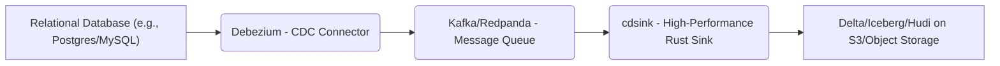
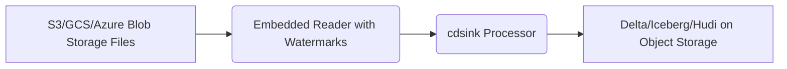
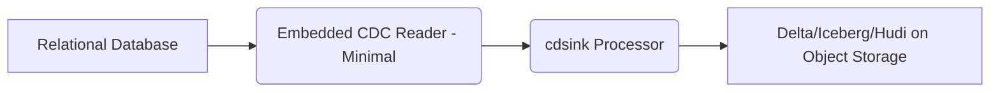

# Overview

Motivation behind the `cdsink` project and its overview.

## Rationale

The Lakehouse architecture has rapidly become the standard choice for building
modern data platforms. Its major advantage—the separation of compute and
storage—is a direct alignment with broader industry trends toward cloud native
solutions.

In the context of widespread cloud computing adoption, most organizations
already rely on highly reliable and cost-effective S3-compatible object storage
for data persistence. This crucial decoupling enables data teams to eliminate
persistent, stateful workloads within the data platform itself. Instead, they
can leverage stateless compute for analytics using services like BigQuery,
Redshift Serverless, or ClickHouse. This approach fundamentally simplifies the
overall data platform architecture and dramatically enhances its reliability and
cost-efficiency.

A significant complexity remains, however: even with a decoupled Lakehouse,
companies are still pressured to set up and maintain complex, resource-intensive
data processing platforms like Apache Spark or Apache Flink. While these are
mature frameworks for handling truly massive data, the reality is that the vast
majority of organizations lack the truly "big data" volumes that genuinely
require such tools. Consequently, teams are burdened by frameworks that are
overly hardware-intensive and demand specialized human resources.

This project is specifically designed to fill this exact operational and cost
gap.

### Core Project Goals

We aim to deliver a high-performance tool that empowers data teams without the
need for heavyweight infrastructure:

* [Goal 1] Simplified Stream Ingestion: To provide a free, lightweight, and
  easy-to-maintain solution for streaming transactional data—such as database
  Change Data Capture (CDC) streams—directly into open table formats like Delta
  Lake, Apache Iceberg, or Apache Hudi with or without upserts.

* [Goal 2] Optimal Resource Efficiency: To achieve the lowest possible hardware
  and resource requirements through the utilization of high-performance
  technologies (like Rust) to drastically reduce cloud compute costs.

### Essential Modern Capabilities

In conjunction with our primary goals, the following features are considered
absolutely necessary for a modern, best-in-class data processing tool:

* [Goal 3] Architectural Modularity: To feature a design that is open for
  seamless adoption of new data formats, sources, and targets via a flexible
  plugin architecture.

* [Goal 4] In-Process Transformation: To provide an optional way to perform
  reliable, SQL-based data transformations and quality checks on the fly during
  the ingestion process.
  
* [Goal 5] Automatic Schema inferring and evolution: in many systems like
  DataBricks, Arroy, RisingWave etc, schema evolution is a paid feature. But in
  in real applications it's absolutely a must. Modern applications even of small
  size contain usually 100-150-200 tables and during rapid development the
  schema is constantly evolving. Because of that it's impractical to require
  schema to be defined upfront and managed manually.

* [Goal 6] Dead Letter Queue. Failed records should not block pipeline, but
  rather be recorded separately in a defined by user format (CSV/JSON,AVRO etc).
  This is just a standard industry practice.

* [Goal 7] Integration with modern observability tools. Not a feature but a
  standard requirement.

## Description

### Programming Language

**Rust** has been selected as the implementation language for several strategic
reasons that directly support the project's goals of efficiency and
maintainability:

1. Optimal Resource Efficiency: Rust enables the creation of a highly
hardware-efficient application. Its focus on performance, low-level control, and
zero-cost abstractions allows for maximum throughput with the lowest possible
memory and CPU footprint, which is crucial for achieving our goal of minimizing
cloud compute costs.

2. Industry Standard for New Data Tools: Rust is rapidly becoming the standard
choice for building the next generation of high-performance data processing
libraries and tools. This is evidenced by its adoption in foundational projects
like:
  * Apache Arrow (for in-memory columnar data management)
  * Apache DataFusion (for vectorized SQL query execution)

3. Maturing Lakehouse Ecosystem: The ecosystem for open table formats within
   Rust is maturing quickly, providing the necessary transactional support:
  * delta-rs for Delta Lake
  * iceberg-rust for Apache Iceberg
  * hudi-rs for Apache Hudi (not ready yet but in active development)

Choosing Rust ensures we are building upon a modern, high-performance foundation
that is both resource-efficient and aligned with the future trajectory of the
data engineering landscape.

### On the fly data transformations

Apache DataFusion SQL has been selected for in-process data transformations as
the optimal fit for this project because of the following reasons:

1. Modularity and Extensibility: To support long-term extensibility with many
   different data sources and targets, a direct converter for every (source,
   target) pair would be unfeasible (an $N \times M$ complexity problem).
   Therefore, a conversion flow of Source $\to$ Common Columnar Format $\to$
   Target must be performed. While this conversion consumes some CPU for
   deserialization, the benefit of achieving a clean, modular $(N+M)$ design far
   outweighs the marginal CPU cost. This deliberate trade-off is the better
   architectural approach for a flexible tool.

2. Performance and Ecosystem Alignment: DataFusion is the emerging, highly
   efficient, in-process data processing engine built on Apache Arrow.
   Transforming source data into a DataFusion DataFrame (an Arrow-based
   structure) allows us to perform SQL-based transformations and then write
   results efficiently into S3-like storage in various formats (like Parquet,
   CSV, JSON) or directly into the Delta Lake/Iceberg format.

3. Usability and Functional Power: SQL is an easy-to-read declarative language
   familiar to most developers, eliminating the need to learn a new
   transformation language. If the standard DataFusion SQL functionality is
   insufficient, it can be easily extended by custom User-Defined Functions
   (UDFs). This SQL-based approach allows us to perform not only simple
   transformations but also complex filtering and aggregation logic within
   micro-batches on the fly, making the solution suitable for both Lakehouse
   ingestion and broader stream processing tasks.

### Schema evolution

As it was noted in [Goal 5] initial schema inferring and further schema
evolution is a must for an ingestion part of a modern Data Platform. From the
other side it's not always easy to detect automatically whether a new column has
been added or an old one has been renamed. Because of that the basic version
supports only initial inferring and adding new columns. A future version might
have integration with such schema management tools like `arigo/atlas`.

### Dead letter queue

In order to avoid failing an entire table processing because of a couple of
malformed records the dead letter queue is used. Users should be able to
configure a desired target and format where and how to write a dead letter
queues.

### Target audience

Small/Mid. size data engineering teams with datasets under several TB.

Technically it should be possible to scale further but a really large data sets
likely will require more specialized tools.

### Typical data flow

#### MVP scope

**Note on Kafka and CDC Architecture**

Recognizing the enduring industry trend toward microservices and loosely coupled
macroservices, the elimination of Apache Kafka is not a priority for this
project. The industry standard for transactionally sound event exchange remains
a Debezium + Kafka setup implementing the Transaction Outbox pattern. This
architecture is crucial for two key reasons:

1. Supporting heterogeneous non-functional requirements across bounded contexts.
   Kafka and Debezium provide strong ordering, durability, and replay semantics
   that allow different services — each with its own latency, availability, or
   data-retention needs — to integrate safely without tight coupling.

2. Maintaining smaller, well-defined application contexts. Clear, decoupled
   context boundaries are increasingly important as organizations look to
   integrate Large Language Models (LLMs) into development workflows. The
   ability to keep these contexts narrow and semantically coherent reduces
   cognitive complexity for both humans and machines.

Despite its reputation as “heavyweight,” Kafka remains entirely accessible to
small and mid-sized organizations:

* Managed Kafka offerings (e.g., Confluent Cloud, AWS MSK Serverless, Aiven)
  drastically reduce operational overhead.
* Self-hosted Kafka via Kubernetes operators (Strimzi, Redpanda operator if not
  strict about protocol compliance) is also viable at moderate scale. In the
  absence of very high throughput requirements, these setups are stable,
  predictable, and require minimal day-to-day attention.
* Debezium + Kafka still represents the most battle-tested, failure-tolerant CDC
  pipeline available for operational databases.

Because of this, cdsink is designed to integrate naturally into existing
Kafka-backed CDC ecosystems rather than attempting to replace Kafka or Debezium.
The goal is to simplify downstream ingestion — not to reinvent the event
backbone that already works well for the majority of organizations.

#### Next versions

**Description**: This feature introduces an embedded reader (Executor) within
cdsink capable of reading structured or semi-structured files (e.g., Parquet,
JSON, CSV) directly from S3-compatible object storage. It is designed to handle
two key scenarios outside of the primary CDC stream:

1. Bulk Initial Loads: Efficiently loading large volumes of historical data from
   existing file repositories into a new Lakehouse table.
2. Backfilling and Reconciliation: Serving as a reliable, periodic job to
   process files generated by other systems or partners (File-based Integration
   ETL), ensuring these data sources can also leverage the Lakehouse format's
   transactional integrity.

Technical Implication (Watermarks): The use of watermarks (based on file
modification time or embedded metadata) is crucial. It ensures the ingestion is
idempotent, preventing redundant reprocessing of previously indexed files and
making the solution suitable for simple, scheduled, serverless execution. This
reader component will leverage the efficiency of Apache Arrow for columnar
reading and the DataFusion engine for any necessary initial standardization or
filtering before sinking.

#### Maybe in the future

**Description**: This represents the ultimate simplification for teams seeking
database-to-lakehouse streaming without any intermediate components (like
Kafka). It involves integrating a minimal, database-specific Change Data Capture
client directly into `cdsink`.

Target Audience: This is exclusively aimed at small teams or solo developers who
are strongly adverse to operating or paying for a message queue (even managed
Kafka/Redpanda). By embedding the reader, the entire pipeline is reduced to a
single executable service, minimizing deployment complexity and cloud costs.

Strategic Considerations: While offering the simplest pipeline, this feature is
marked as "Future" because it is a significant engineering undertaking. It
requires implementing and maintaining robust, performational CDC clients (e.g.,
using logical decoding for Postgres, binlog for MySQL) for multiple databases.
This complexity must be balanced against the project's core mission of high
performance and low maintenance. It will be prioritized after the core
Kafka-based architecture is proven stable and production-ready.
